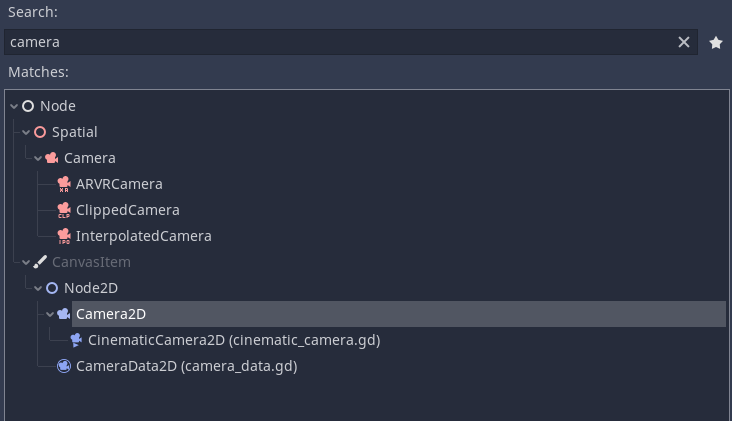
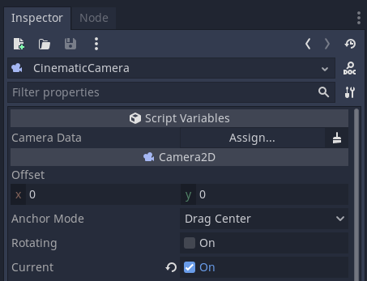
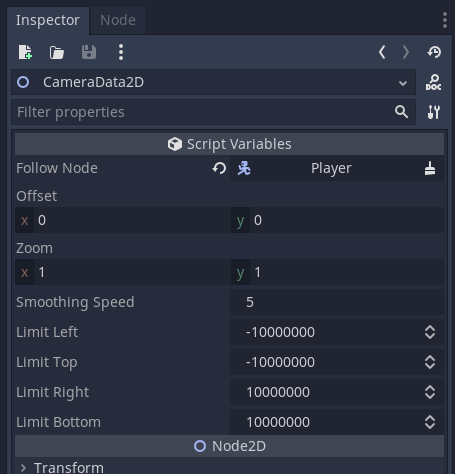

# Cinematic Camera 2D

**Cinematic Camera 2D** is a plugin that adds a 2D cinematic camera that can be used to create smooth transitions between cameras.

This repository contains the plugin files and a demo that shows the usage of the plugin.

## Support

**Cinematic Camera 2D** was developed by HexagonNico. Please consider supporting the project with a donation if you like this plugin!

[](https://ko-fi.com/X8X87EZ87)

Consider also trying my games: [hexagonnico.itch.io](https://hexagonnico.itch.io)

## Plugin contents

The plugin contains two scripts: `camera_data.gd` and `cinematic_camera.gd`. Both can be added to your scenes as nodes through the "Create New Node" menu.

The **CameraData2D** node is a virtual camera. It controls the movement of a camera and its settings.

The **CinematicCamera2D** node is the camera itself. It extends the Camera2D node and needs a reference to a CameraData2D node that can be assigned to it through the inspector or with a script.



## Creating a camera

Open the "Create New Node" menu and search for "CinematicCamera2D". You will see that this node has one more property than the basic camera, that is a node path to a CameraData2D node.



Open the "Create New Node" menu again and this time look for a "CameraData2D". This node contains all the properties that are used by a cinematic camera.

Now go back to the CinematicCamera2D node and set the 'Camera Data' property to the CameraData2D node you just added.



If you modify the properties of the CameraData2D node, you will see that you camera will now smoothly transition to these values.

## Following the player

The cinematic camera mainly does two things for you: updating the camera properties and following another node.

If you want your cinematic camera to follow the player, go to the CameraData2D node and set the 'Follow Node' property to your player node.

## Transitioning between cameras

The true strength of the Cinematic Camera 2D plugin is the ability to create smooth transitions between cameras.

Add another CameraData2D node to your scene and try changing some of its properties like the 'Zoom' value.

Now, if you change the 'Camera Data' property in your CinematicCamera2D node, you will see that the camera is now using the values of the other CameraData2D node.

The value of 'Camera Data' can also by updated from scripts to create transitions between the two cameras.

```
export var camera_data: NodePath

func _ready() -> void:
	cinematic_camera.camera_data = get_node(camera_data)
```

Try adding the following script to your scene's root:


```
extends Node2D

onready var camera: CinematicCamera2D = $CinematicCamera2D

onready var camera_data_1: CameraData2D = $CameraData2D
onready var camera_data_2: CameraData2D = $CameraData2D2

func _input(event: InputEvent) -> void:
	if event is InputEventKey and event.is_pressed():
		if event.scancode == KEY_1:
			camera.camera_data = camera_data_1
		elif event.scancode == KEY_2:
			camera.camera_data = camera_data_2
```

This script will change between the two cameras every time you press the '1' and '2' buttons.

## Contributing

Cinematic Camera 2D is open to contribution. If you want to contribute with a new kind of property or a new feature, please consider also contributing to the documentation.
